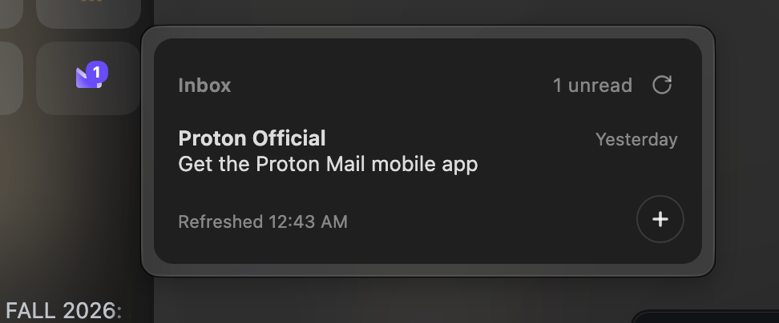

# Email Peek

Peek at your inbox without leaving whatever you were actually doing.

Hover a pinned Gmail, Proton Mail, or Outlook tab in Zen and a small popup
slides in with your unread mail — sender, subject, and when it landed. Click an email
to open it in the tab, or hit `+` to fire off a new one. That's the whole
trick: no API keys, no OAuth ceremony, no third-party service. It reads mail
through the session you're already signed in with.

## What you get

- **Unread mail only.** If the list is empty, congratulations — you're done.
- **Unread-count badge** right on the tab icon.
- **Refreshes every time you hover.** The bottom-left corner narrates
  `Refreshing.` → `..` → `...`, then settles into `Refreshed 12:34 PM`
  so you always know how stale the list isn't.
- **Multi-account aware.** It reads the account index off each tab's own URL
  (`/u/N/` for Gmail/Proton, `/mail/N/` for Outlook), so your work inbox and
  your other work inbox each get their own preview.
- **Compact-mode friendly.** In Zen's compact mode the sidebar politely
  holds still while the popup is open instead of folding away mid-peek.

## Install

1. Install [Sine](https://github.com/CosmoCreeper/Sine) — the JS mod loader
   for Zen/Firefox forks. No browser recompile needed.
2. In Zen: `Settings → Sine` → paste this repo's URL into the install field.
3. Pin your mail tab (or drag it to Essentials). Hover. Done.

> Marketplace status: not on the Sine store yet. A submission went in, the
> store's automation tripped over its own shoelaces before it could read the
> manifest, and a resubmit is queued. Installing by repo URL works fine today.

## Gmail Peek

The Gmail half, pictured up top. Hover your pinned Gmail tab and your unread
mail appears — sender, subject, a snippet, and how long ago it arrived.
Requires Gmail signed in **in the default (non-container) context**.

## + Proton Peek

Same trick for Proton Mail tabs, purple badge included. Proton encrypts
everything and offers no handy feed, so Email Peek keeps a tiny hidden
browser pointed at your mailbox and reads the rendered list — decrypted
subjects go straight from the page to the popup and nowhere else. The peek
follows the tab's **pinned home view** — so if you wander the pinned tab off
to Sent or a settings page, the popup still shows your unread pile (and if
the home can't be found, it falls back to all-mail unread for that account).

## + Outlook Peek

And the blue corner of the triangle. Same hidden-browser trick as Proton —
Outlook is a client-side SPA with no feed, so Email Peek reads the rendered
message list out of a tucked-away `<browser>` that shares your session and
never sleeps. It anchors on OWA's semantic hooks (`data-convid`, `role=option`,
the `Unread` prefix in each row's accessible name, the `New mail` button)
rather than Microsoft's minified classnames, so a cosmetic Outlook refresh
should degrade gracefully instead of vanishing. Works with outlook.live.com,
outlook.com, and the Office 365 flavors. Also follows the pinned home view,
unread-only, badge included.

## Settings

In Sine → Mod Settings (or `about:config`):

| Pref | Default | What |
| --- | --- | --- |
| `mod.gmailpeek.account` | `0` | Fallback account index when a tab URL has no `/u/N/` |
| `mod.gmailpeek.max_items` | `6` | Emails shown in the popup |
| `mod.gmailpeek.hover_delay` | `400` | ms before the preview opens |
| `mod.gmailpeek.hide_delay` | `150` | ms before the preview closes on mouse-out |
| `mod.gmailpeek.show_badge` | `true` | Unread badge on the tab icon |

The Proton and Outlook halves take the same set under `mod.protonpeek.*` and
`mod.outlookpeek.*`, each with an `enabled` pref to toggle it independently.

## Under the hood

For the curious; nothing below is required reading.

- **Gmail** fetches `https://mail.google.com/mail/u/N/feed/atom` from the
  browser's chrome context, riding your existing session cookies. The feed
  only ever contains unread mail, which is exactly what the popup shows.
- **Proton** has no Atom feed and its API payload is end-to-end encrypted,
  so the mod keeps a hidden 1×1 `<browser>` per account — always loaded,
  never asleep, sharing the normal cookie jar — pointed at your mailbox view
  with `filter=unread` forced into the URL hash. A `JSWindowActor` reads the
  rendered DOM out of that hidden browser, so the pinned tab is free to
  sleep or wander off to other folders.
- Extraction anchors on Proton's semantic/test attributes
  (`data-element-id`, `data-testid`, `aria-labelledby`, `<time datetime>`)
  rather than styling classes, with layered fallbacks at every step — the
  idea being that a cosmetic UI refresh shouldn't break your inbox peek.
  Rows positively identified as read are dropped, and loading skeletons are
  never mistaken for mail.
- Clicking a row navigates the tab to Proton's canonical
  `/u/N/<label>/<elementId>` route. The unread badge reads the `(N)` prefix
  Proton puts in the tab title.
- **Outlook** uses the same phantom-browser + actor architecture, tuned to
  OWA's rendered DOM: rows are `[data-convid][role=option]` in the
  `#MailList` listbox, unread rows announce themselves with an `Unread`
  prefix in their `aria-label`, sender lives in `span[title="<email>"]`, and
  the timestamp hides in a `title` attribute. Clicking a row opens the
  canonical `/mail/N/<folder>/id/<convid>` route; `+` hunts the
  `New mail` button and falls back to `/mail/deeplink/compose`.
- Requires Sine (or fx-autoconfig) with the `chrome://userscripts/` mapping.
  Actor modules are written to `<profile>/chrome/JS/proton-peek/` on first
  run; if no chrome URI resolves, it falls back to `data:` module URIs.

## Known limitations

- Container-isolated Gmail sessions can't be read via the Atom feed
  (cookies live in the container jar). Would need a Gmail API + OAuth
  variant.
- Zen's native tab tooltip is suppressed via `popupshowing` interception;
  if a Zen update changes tooltip plumbing it may reappear alongside the
  panel.
- Zen updates can wipe the Sine bootloader — reinstall Sine if mods vanish.
