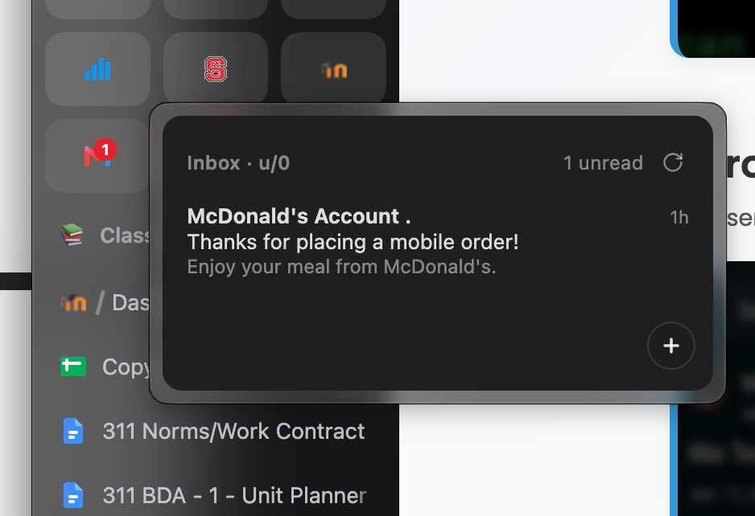

# Gmail Peek

Arc-style Gmail preview for Zen Browser. Hover your pinned/essential Gmail
tab and get a popup with your recent unread emails — sender, subject,
snippet, and how long ago it arrived. Click an email to open it in the tab,
or hit `+` to start a compose.

## How it works

- Fetches `https://mail.google.com/mail/u/N/feed/atom` from the browser's
  chrome context. The request uses your existing Google session cookies —
  **no API key, no OAuth setup**.
- **Multi-account**: the account index is read from each tab's own URL
  (`/u/0/`, `/u/1/`...), so hovering different pinned Gmail tabs previews
  the right inbox. `mod.gmailpeek.account` is only a fallback for tabs
  whose URL carries no `/u/N/`.
- The feed only contains **unread** mail, so the preview mirrors what Arc
  shows.
- Every popup opening refreshes the preview, displaying cached mail while
  the new request runs. The footer shows “Refreshing…” followed by the
  local time of the last successful refresh; failed attempts are labeled.
- Bonus: an unread-count badge on the tab icon (toggleable), refreshed on
  every hover and every 2.5 minutes.

## Install

1. Install [Sine](https://github.com/CosmoCreeper/Sine) (the JS mod loader
   for Zen/Firefox forks — no browser recompile needed).
2. In Zen: `Settings → Sine` → paste this repo's URL into the install
   field — or find **Gmail Peek** on the
   [Sine marketplace](https://sineorg.github.io/store/).
3. Pin Gmail (or drag it to Essentials), hover it.

## Requirements
- Gmail pinned as a **pinned tab** or an **essential**.
- Gmail signed in **in the default (non-container) context** — the feed
  request sends cookies from the default cookie jar. If you keep Gmail in a
  Firefox container, the request can't authenticate and the popup will show
  a sign-in prompt instead.

## Settings

Configurable in Sine → Mod Settings (or `about:config`):

| Pref | Default | What |
| --- | --- | --- |
| `mod.gmailpeek.account` | `0` | Fallback account index when a tab URL has no `/u/N/` |
| `mod.gmailpeek.max_items` | `6` | Emails shown in the popup |
| `mod.gmailpeek.hover_delay` | `400` | ms before the preview opens |
| `mod.gmailpeek.hide_delay` | `150` | ms before the preview closes on mouse-out |
| `mod.gmailpeek.show_badge` | `true` | Unread badge on the tab icon |

## Proton Peek

The same mod also ships `proton-peek.uc.js`, an Arc-style preview for pinned
Proton Mail tabs. Proton has no Atom feed and its API is end-to-end encrypted,
so instead of a network request the mod keeps a hidden 1×1 `<browser>` per
account — always loaded, never asleep — showing the same mailbox view as your
pinned tab, and reads the rendered DOM out of it via a `JSWindowActor`. Your
decrypted subjects are passed locally to the browser popup, not sent to an
external service. The pinned tab can sleep while the hidden browser stays
loaded.

- Pin Proton Mail on any mailbox view you like (e.g.
  `https://mail.proton.me/u/1/almost-all-mail#filter=unread`) — the popup
  mirrors that view. `/u/N/` multi-account works.
- Extraction anchors on Proton's semantic/test attributes
  (`data-element-id`, `data-testid`, `aria-labelledby`, `<time datetime>`),
  not styling classes, with layered fallbacks at every step.
- Clicking a row navigates the pinned tab to Proton's canonical
  `/u/N/<label>/<elementId>` route.
- Unread badge reads the `(N)` prefix Proton puts in the tab title (real tab
  or phantom); falls back to counting scraped unread rows.
- Requires Sine or fx-autoconfig's `chrome://userscripts/` mapping. The actor
  modules are written to `<profile>/chrome/JS/proton-peek/` on first run;
  if no chrome URI resolves, it falls back to `data:` module URIs.

Toggle it independently via `mod.protonpeek.enabled`. Same
`account`/`max_items`/`hover_delay`/`hide_delay`/`show_badge` prefs,
under the `mod.protonpeek.*` prefix.

## Known limitations

- Container-isolated Gmail sessions can't be read via the Atom feed
  (cookies live in the container jar). Would need the Gmail API + OAuth
  variant.
- Zen's native tab tooltip is suppressed via `popupshowing` interception;
  if a Zen update changes tooltip plumbing it may reappear alongside the
  panel.
- Zen updates can wipe the Sine bootloader — reinstall Sine if mods vanish.
